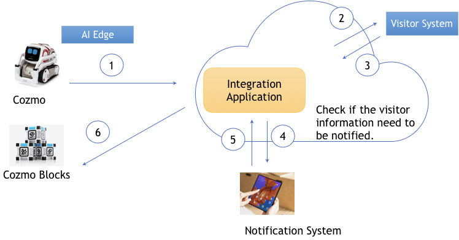

# Smart Pack UserCase

1. Cozmo guard program just identify the user ID with its camera,  and then calling the integration appliction service.
2. Integration Service call the Visitor System with the user ID for checkin.
3. VisitorSystem send back the response message with the check in time of visitor.
4. Integration Service just send the visitor information to the Notification System.
5. Notification System send back the response.
6. Integration Application just send back the response message to Cozmo guard program.





 Here are the camel route
```java
public void configure() throws Exception {
  restConfiguration().component("restlet").host("0.0.0.0").port("9080");

  rest().get("/visitor/{name}").to("direct:visitorCheckIn");

  from("direct:visitorCheckIn")
    .transform().simple("{\"visitorName\":\"${header.name}\"}")
    .removeHeaders("*")
    .setHeader(Exchange.HTTP_METHOD, constant(org.apache.camel.component.http4.HttpMethods.POST))
    .setHeader(Exchange.CONTENT_TYPE, constant("application/json"))
    .to("http4://" + visitorServiceAddress + "/visitors/checkIn")
    .transform().jsonpath("$.visitorName")
    .to("direct:notifyService");

  from("direct:notifyService")
    .choice()
        .when().simple("${body} == \"Alex\"")
            .transform().simple("VIP ${body}")
        .end()
    .setHeader("message").simple("Welcome ${body} to robot world")
    .transform().simple("{\"message\":\" ${body} is here.\"}")
    .setHeader(Exchange.HTTP_METHOD, constant(org.apache.camel.component.http4.HttpMethods.POST))
    .setHeader(Exchange.CONTENT_TYPE, constant("application/json"))
    .to("http4://" + notificationServiceAddress + "/notification/notify")
    .setBody().simple("${headers.message}")
        .removeHeaders("*");
}

```

## Components

### Cozmo

guard.py program makes Cozmo turn toward a face and send the requests backend service if it
find out the visitor name, and say the welcome words from the service response.

### visitor-service

It provide visitor checkin service from the restful service url visitor/checkin, the response message has the visitor checkin time information. 

###notification-service

It's provide the web interface which could be used for the user to register himself,  user can receive the notification, once there is a notification message which is sent to the notification service. 

### camel-route

The spring-boot version of camel application with camel route which is defined in CamelRoute.java

### camel-k-runtime-routes

The Camel routes which could be used with the camel-k-runtime. You can use mvn exec:java to start up the route.


